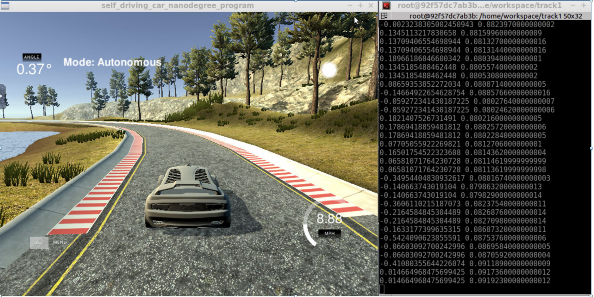

# Behavioral Cloning Project

[](http://www.udacity.com/drive)

1.Overview
---
This repository contains starting files for the Behavioral Cloning Project.

In this project, you will use what you've learned about deep neural networks and convolutional neural networks to clone driving behavior. You will train, validate and test a model using Keras. The model will output a steering angle to an autonomous vehicle.

We have provided a simulator where you can steer a car around a track for data collection. You'll use image data and steering angles to train a neural network and then use this model to drive the car autonomously around the track.

We also want you to create a detailed writeup of the project. Check out the [writeup template](https://github.com/udacity/CarND-Behavioral-Cloning-P3/blob/master/writeup_template.md) for this project and use it as a starting point for creating your own writeup. The writeup can be either a markdown file or a pdf document.

To meet specifications, the project will require submitting five files: 
* model.py (script used to create and train the model)
* drive.py (script to drive the car - feel free to modify this file)
* model.h5 (a trained Keras model)
* a report writeup file (either markdown or pdf)
* video.mp4 (a video recording of your vehicle driving autonomously around the track for at least one full lap)

This README file describes how to output the video in the "Details About Files In This Directory" section.

2.Creating a Great Writeup
---
A great writeup should include the [rubric points](https://review.udacity.com/#!/rubrics/432/view) as well as your description of how you addressed each point.  You should include a detailed description of the code used (with line-number references and code snippets where necessary), and links to other supporting documents or external references.  You should include images in your writeup to demonstrate how your code works with examples.  

All that said, please be concise!  We're not looking for you to write a book here, just a brief description of how you passed each rubric point, and references to the relevant code :). 

You're not required to use markdown for your writeup.  If you use another method please just submit a pdf of your writeup.

The Project
---
The goals / steps of this project are the following:
* Use the simulator to collect data of good driving behavior 
* Design, train and validate a model that predicts a steering angle from image data
* Use the model to drive the vehicle autonomously around the first track in the simulator. The vehicle should remain on the road for an entire loop around the track.
* Summarize the results with a written report

### Dependencies
This lab requires:

* [CarND Term1 Starter Kit](https://github.com/udacity/CarND-Term1-Starter-Kit)

The lab enviroment can be created with CarND Term1 Starter Kit. Click [here](https://github.com/udacity/CarND-Term1-Starter-Kit/blob/master/README.md) for the details.

The following resources can be found in this github repository:
* drive.py
* video.py
* writeup_template.md

The simulator can be downloaded from the classroom. In the classroom, we have also provided sample data that you can optionally use to help train your model.

## Details About Files In This Directory

### `drive.py`

Usage of `drive.py` requires you have saved the trained model as an h5 file, i.e. `model.h5`. See the [Keras documentation](https://keras.io/getting-started/faq/#how-can-i-save-a-keras-model) for how to create this file using the following command:
```sh
model.save(filepath)
```

Once the model has been saved, it can be used with drive.py using this command:

```sh
python drive.py model.h5
```

The above command will load the trained model and use the model to make predictions on individual images in real-time and send the predicted angle back to the server via a websocket connection.

Note: There is known local system's setting issue with replacing "," with "." when using drive.py. When this happens it can make predicted steering values clipped to max/min values. If this occurs, a known fix for this is to add "export LANG=en_US.utf8" to the bashrc file.

#### Saving a video of the autonomous agent

```sh
python drive.py model.h5 run1
```

The fourth argument, `run1`, is the directory in which to save the images seen by the agent. If the directory already exists, it'll be overwritten.

```sh
ls run1

[2017-01-09 16:10:23 EST]  12KiB 2017_01_09_21_10_23_424.jpg
[2017-01-09 16:10:23 EST]  12KiB 2017_01_09_21_10_23_451.jpg
[2017-01-09 16:10:23 EST]  12KiB 2017_01_09_21_10_23_477.jpg
[2017-01-09 16:10:23 EST]  12KiB 2017_01_09_21_10_23_528.jpg
[2017-01-09 16:10:23 EST]  12KiB 2017_01_09_21_10_23_573.jpg
[2017-01-09 16:10:23 EST]  12KiB 2017_01_09_21_10_23_618.jpg
[2017-01-09 16:10:23 EST]  12KiB 2017_01_09_21_10_23_697.jpg
[2017-01-09 16:10:23 EST]  12KiB 2017_01_09_21_10_23_723.jpg
[2017-01-09 16:10:23 EST]  12KiB 2017_01_09_21_10_23_749.jpg
[2017-01-09 16:10:23 EST]  12KiB 2017_01_09_21_10_23_817.jpg
...
```

The image file name is a timestamp of when the image was seen. This information is used by `video.py` to create a chronological video of the agent driving.

### `video.py`

```sh
python video.py run1
```

Creates a video based on images found in the `run1` directory. The name of the video will be the name of the directory followed by `'.mp4'`, so, in this case the video will be `run1.mp4`.

Optionally, one can specify the FPS (frames per second) of the video:

```sh
python video.py run1 --fps 48
```

Will run the video at 48 FPS. The default FPS is 60.

#### Why create a video

1. It's been noted the simulator might perform differently based on the hardware. So if your model drives succesfully on your machine it might not on another machine (your reviewer). Saving a video is a solid backup in case this happens.
2. You could slightly alter the code in `drive.py` and/or `video.py` to create a video of what your model sees after the image is processed (may be helpful for debugging).

### Tips
- Please keep in mind that training images are loaded in BGR colorspace using cv2 while drive.py load images in RGB to predict the steering angles.

## How to write a README
A well written README file can enhance your project and portfolio.  Develop your abilities to create professional README files by completing [this free course](https://www.udacity.com/course/writing-readmes--ud777).


**3.Implementation:****

[]


**4. Submission code is usable and readable**

The model.py file contains the code for training and saving the convolution neural network. The file shows the pipeline I used for training and validating the model, and it contains comments to explain how the code works. Further, I have also included the code to plot the mean squared error loss for the training set and the validation set per epoch. It helps us to get a better idea of the scenario and gives us a lot of information on the various parameters to tune to get a much better result.

**5.Model Architecture and Training Strategy**

**5.1 An appropriate model architecture has been employed**

My model consists of a convolution neural network which is implemented with the help of keras in a much easier way. The model is like the NVIDIA model, and contains five Convolutional layers and four Dense layers. The model also contains a Dropout layer, a Flatten layer and one Cropping2D layer. The data is normalized in the model using a Keras lambda layer. The total number of parameters in the proposed model is 348, 219.
**5.2 Attempts to reduce overfitting in the model**

The model contains dropout layer in order to reduce overfitting. There is a Dropout layer after the five Convolutional Layers to reduce overfitting. The Dropout Layer has a probability of 0.5 to dropout the weights. The model was trained and validated on different data sets to ensure that the model was not overfitting. The model was tested by running it through the simulator and ensuring that the vehicle could stay on the track.

**5.3 Model parameter tuning**
The model uses an Adam optimizer, so the learning rate is tuned manually. "optimizer=Adam(lr=1.0e-4)" depicts the usage of Adam optimizer with a learning rate of "1.0e-4". The number of epochs is set to 10 and batch_size is set to 32.

**5.4 Appropriate training data**
Training data was chosen to keep the vehicle driving on the road. I used training data by driving for around three tracks on the road. Nearly 13,000 images including the center, left and right camera images were used to train the model. Various training Data Augmentation techniques were used to augment the training data like random flip, random translate, random brightness and RGB to YUV image conversion just as NVIDIA uses in its model.


**Images Captured while running vehicle using Automonous mode simulator**

[]


[]


**6. Architecture and Training Documentation**

**6.1 Solution Design Approach**
In order to gauge how well the model was working, I split my image and steering angle data into a training and validation set with train_test_split() function with a relative test size of 0.2. I used generator so that a part of training data images is operated upon at a given time. I used NVIDIA like model with five convolutional layers and four dense layers alongwith flatten, dropout layers. Used training data of size approx. 3766 images to train the model. Also, augmented all of the images in the training data. In the end, after training, when the model is saved, a plot is also depicted to show the training and validation losses. Steering corrections are also introduced along with appropriate camera images i.e. left, right and center camera images. At the end of the process, the vehicle is able to drive autonomously around the track without leaving the road.

**6.2 Final Model Architecture**

The model architecture is depicted below with the help of table:
Layer	Output Shape	Param
_________________________________________________________________
Layer (type)                 Output Shape              Param #   
=================================================================
cropping2d_1 (Cropping2D)    (None, 65, 320, 3)        0         
_________________________________________________________________
lambda_1 (Lambda)            (None, 65, 320, 3)        0         
_________________________________________________________________
conv2d_1 (Conv2D)            (None, 31, 158, 24)       1824      
_________________________________________________________________
conv2d_2 (Conv2D)            (None, 14, 77, 36)        21636     
_________________________________________________________________
conv2d_3 (Conv2D)            (None, 5, 37, 48)         43248     
_________________________________________________________________
conv2d_4 (Conv2D)            (None, 3, 35, 64)         27712     
_________________________________________________________________
conv2d_5 (Conv2D)            (None, 1, 33, 64)         36928     
_________________________________________________________________
dropout_1 (Dropout)          (None, 1, 33, 64)         0         
_________________________________________________________________
flatten_1 (Flatten)          (None, 2112)              0         
_________________________________________________________________
dense_1 (Dense)              (None, 100)               211300    
_________________________________________________________________
dense_2 (Dense)              (None, 50)                5050      
_________________________________________________________________
dense_3 (Dense)              (None, 10)                510       
_________________________________________________________________
dense_4 (Dense)              (None, 1)                 11        
_________________________________________________________________

**Total params: 348,219
**Trainable params: 348,219
**Non-trainable params: 0
_________________________________________________________________


**6.3 Creation of the Training Set & Training Process**
To capture good driving behavior, I recorded three laps on track two using center lane driving and one for recovery lane driving. I then recorded the vehicle recovering from the left side and right sides of the road back to center so that the vehicle would learn to take decisions when the road is not visible to the camera. I also augment the dataset by flipping the images and the angles. Also, introduced random brightness and random translation.


**Output video for recorded data in Autonomous mode**

[](https://www.youtube.com/watch?v=7bh60pQa0d4)


**Simulation**
1. Car able to navigate correctly on test data
The car is able to steer correctly through the roads in the simulator for track 1 in autonomous mode
My project files under below path in workspace folder
/home/workspace/track_test1

